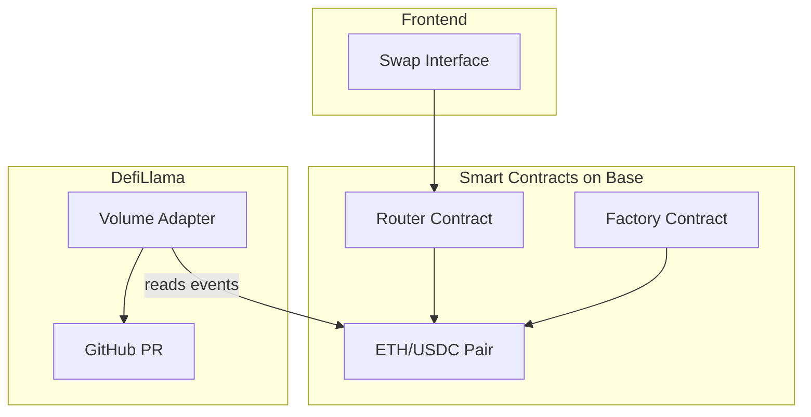

# DEX on DefiLlama - Minimal Viable Listing

## Goal

Deploy a working DEX on the cheapest chain, generate volume, and get listed on DefiLlama.

## Chain Selection: Base

**Why Base over alternatives:**

- Gas fees: ~$0.001-$0.01 per transaction (cheapest EVM L2)
- EVM compatible (can use standard Uniswap V2 fork)
- Good liquidity for USDC/ETH pairs
- DefiLlama already tracks Base DEXes

**Cost breakdown for $100 budget:**

- Contract deployment: ~$1-5
- Initial liquidity: ~$50-80 (ETH/USDC pool)
- Self-trading gas: ~$10-20 (1000+ swaps at $0.01 each)
- Buffer: ~$10

## Architecture




## Technical Stack

- **Contracts**: Uniswap V2 fork (battle-tested, simple)
- **Chain**: Base Mainnet
- **Frontend**: Single HTML file with ethers.js (minimal)
- **Adapter**: TypeScript for DefiLlama

## Implementation Steps

### Phase 1: Smart Contracts

Fork Uniswap V2 core contracts:

- `UniswapV2Factory.sol` - Creates pairs
- `UniswapV2Pair.sol` - AMM logic with Swap events
- `UniswapV2Router02.sol` - User-facing swap functions

Set fees to 0.01% (minimal) to maximize volume per dollar.

### Phase 2: Deployment

1. Deploy Factory contract
2. Deploy Router contract
3. Create ETH/USDC pair
4. Add initial liquidity (~$50-80 worth)

### Phase 3: Generate Volume

Create a simple script that:

- Swaps ETH -> USDC -> ETH in a loop
- Runs ~100-1000 trades to establish volume history
- Cost: ~$10-20 in gas

### Phase 4: DefiLlama Adapter

Create adapter in TypeScript that:

- Reads `Swap` events from your pair contract
- Returns `dailyVolume` dimension
- Submit PR to `DefiLlama/dimension-adapters` repo

## DefiLlama Adapter Structure

```
dimension-adapters/
  dexs/
    your-dex-name/
      index.ts  <- Your adapter
```

Adapter must export:

- `fetch()` function returning `{ dailyVolume: { "base:0x...": amount } }`
- Chain config pointing to Base

## Files to Create

1. `contracts/UniswapV2Factory.sol`
2. `contracts/UniswapV2Pair.sol`
3. `contracts/UniswapV2Router02.sol`
4. `contracts/libraries/*.sol` (Math, SafeMath, etc.)
5. `scripts/deploy.js` - Deployment script
6. `scripts/trade.js` - Self-trading bot
7. `frontend/index.html` - Simple swap UI
8. `adapter/index.ts` - DefiLlama adapter

## Realistic Expectations

With $100 and self-trading:

- Daily volume achievable: $1K-$10K
- Ranking: Will appear on DefiLlama, likely bottom of list
- Timeline: 1-2 days to build, 1-2 days for PR review

## Risks

- DefiLlama may reject if volume looks too artificial
- Need to maintain some ongoing activity to stay listed
- Base gas can spike during congestion

